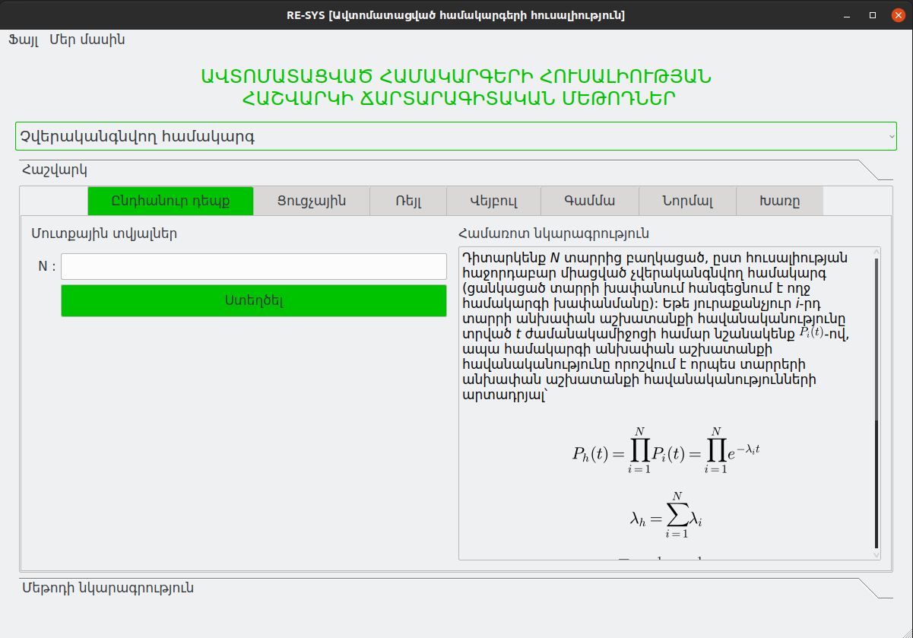

# Re-Sys, Reliably Systems
- This is a PyQt 5 window application project.
- Made using Python 3, PyQt5, Numpy, Matplotlib and etc.

# How to install
- Create virtual environment.
- Install python requirements.txt file, `pip3 install -r requirements.txt`.

# Run the project
- Run `python ReSys.py`
- The window view: 

